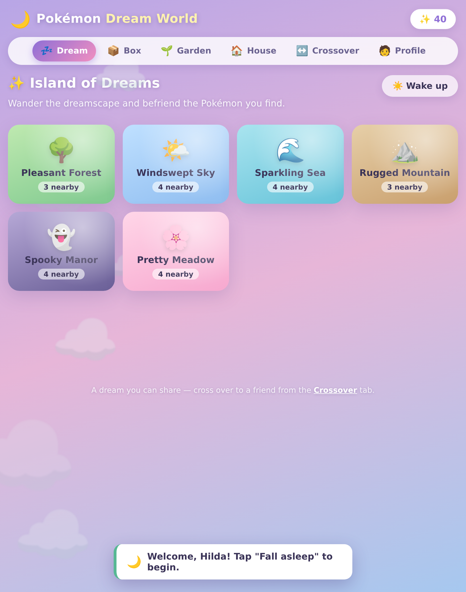

# 🔴 Pokémon Unova — Dream Journey

A Pokémon **Black & White-style RPG** you play in the browser — walk the
overworld, battle and catch Pokémon, earn badges, master every HM, and beat the
**Elite Four & Champion**. Then step through the **Entralink** into a fully
shareable **Dream World** where you can **cross over** into another player's
dream and trade Pokémon.

No build step, no dependencies, no accounts. Runs on plain Node + a browser.



## ▶️ Run it

```bash
npm start        # serves on http://127.0.0.1:4173
# or: node server.js
```

Open the printed URL. Progress saves automatically to your browser.

- **RPG:** `http://127.0.0.1:4173/`
- **Card Dex** (scan your real trading cards): `http://127.0.0.1:4173/pokedex/`

- **Move:** Arrow keys / WASD  ·  **Interact / Confirm:** Z / Space / Enter  ·
  **Cancel:** X  ·  **Menu:** Esc  ·  on-screen touch controls on mobile.

## 🎮 Two ways to start

On the title screen:

- **✦ New Adventure** — the full journey. Get a starter from Prof. Juniper and
  work your way north through Unova, earning badges and HMs, to the League.
- **👑 Continue as Champion** — jump straight to the post-game with **all four
  badges, all five HMs, and a team led by Darmanitan** (Lv 55) — free to roam
  and use the Entralink immediately. (Exactly the "beaten E4 + Darmanitan +
  every HM" state.)

## 🗺️ The journey (New Adventure)

Home town → Route 1 → **Striaton** (Gym 1 → **Cut**) → **Desert Resort**
(catch **Darumaka**, which evolves into **Darmanitan**!) → **Nacrene**
(Gym 2 → **Strength**, and an NPC who gives you **Fly**) → Route 3 (roll away
boulders with Strength) → **Castelia** (Gym 3 → **Surf**) → the **Sea**
(Route 4, Surf across) → **Opelucid** (Gym 4 → **Waterfall**) → surf & climb the
falls into **Victory Road** → the **Pokémon League**: **Shauntal, Grimsley,
Caitlin, Marshal**, and **Champion Alder**.

Every HM has a real field use gating your progress:

| HM | Use in the world |
| --- | --- |
| **Cut** | Fell the slim trees blocking the desert. |
| **Strength** | Roll away boulders on Route 3. |
| **Surf** | Cross the sea on Route 4 (and Victory Road's water). |
| **Waterfall** | Climb the falls to reach Victory Road. |
| **Fly** | Fast-travel to any city you've visited (menu → Fly). |

## ⚔️ Battle system

A real turn-based engine: the full **17-type** chart, **STAB**, critical hits,
**status** (burn / poison / badly-poisoned / paralysis / sleep / freeze),
**stat stages**, PP, priority moves, multi-hit, recoil & drain, switching,
items, and **catching** with Poké/Great/Ultra Balls (status & HP affect the
odds). Pokémon gain EXP, **level up, learn moves, and evolve** — Darumaka →
Darmanitan at Lv 35, the starters into their final forms, and more.

## ↔️ The Entralink (1:1 with Black & White — available from the start)

Open the menu (Esc) → **Entralink** and you are *pulled into the Entralink
itself* — the mystical realm at the heart of Unova, exactly like the C-Gear
trip in the original. It works from the very first minute of a new game.

Inside the Entralink map:

- **The glowing Entree tree** — interact for **Game Sync**: tuck in a Pokémon
  and enter the **Dream World** (Island of Dreams, berry garden, dream house).
- **The Entree Forest** (north) — Pokémon you befriend in the Dream World
  physically wake up here, dozing under the trees. Battle them and, just like
  the real Entree Forest, **a Poké Ball never fails** — they join your party
  keeping their **Dream World Hidden Ability**.
- **The white bridges** (east/west) — walk across to **cross over to a
  friend's world**: share a Dream Link code / URL so a friend can visit your
  dream and receive a gift Pokémon, or connect **live, peer-to-peer over
  WebRTC** to visit each other and trade in real time.
- **The warp pads** — return exactly where you were standing in Unova.

The full BW pipeline works end-to-end: befriend in the Dream World → it leaves
the Dream World and waits in the Entree Forest → guaranteed catch → it's in
your game with its Hidden Ability.

The Dream World is also playable on its own at **`/dreamworld.html`**.

## 📇 Card Dex — scan your real Pokémon cards

Open **`/pokedex/`** and hold a real Pokémon trading card up to your camera —
the Card Dex reads the card's name right in your browser (Tesseract.js OCR,
no server, no API key), looks the Pokémon up on [PokéAPI](https://pokeapi.co),
and shows a full Pokédex entry: official artwork, types, dex flavor text,
base stats, height/weight, even its cry. Then **throw a ball** and try to
catch it into your collection — saved in your browser, with catch dates and
duplicate counts, working toward all **1025** species.

### 🌐 Play it anywhere

The repo ships a GitHub Actions workflow that publishes everything to
**GitHub Pages** on every push to the default branch. One-time setup: in the
repo's **Settings → Pages**, set **Source** to **"GitHub Actions"** — then
play at `https://<owner>.github.io/<repo>/pokedex/` (and the RPG at the site
root). Pages serves over **HTTPS, so the camera works on your phone** — no
local server needed. The Card Dex is also a **PWA**: open it on your phone,
"Add to Home Screen", and it launches full-screen like a real Pokédex, with
the app shell, sprites, and OCR engine cached for instant repeat scans.

### 🎮 Catching is a real game

- Every species uses its **real capture rate** from the games — a Caterpie
  is nearly a sure thing, Mewtwo will fight the ball.
- Throws run classic **shake checks**: the ball drops, wobbles up to three
  times… and can **burst open**. Each escape raises your odds a little
  (a pity ramp), so nothing is unwinnable.
- **Ball tiers unlock as your career catch count grows**: Poké Ball from the
  start, Great Ball at 10, Ultra Ball at 25, and the never-miss Master Ball
  at 60. Live catch odds are shown on every ball.
- **✨ Shinies!** Every wild encounter has a 1/64 shiny chance — shiny
  artwork, a golden banner, and a permanent sparkle in your dex.
- Chiptune-style **sound effects** (WebAudio, no assets) and confetti for
  new registrations.

### 🔍 Four ways in

- **📷 Scan** — live camera with a card-shaped guide (needs `localhost` or
  HTTPS for camera access), plus a 🔦 flashlight toggle on phones that
  support it. The scanner reads the name strip first, then the whole card,
  and fuzzy-matches against every species — misreads like "Chorizard",
  glued suffixes like "Charizardex", split names like "Mr. / Mime", and the
  "Evolves from …" trap are all handled.
- **🖼 Photo** — no camera? Scan a photo of the card instead (on phones this
  opens the camera app).
- **🔎 Search** — or just type a name with autocomplete.
- **📕 Pokédex** — your caught collection: progress bar, sprite grid,
  ×N duplicate badges, shiny sparkles, first-caught dates, and Release.

If a scan is ambiguous you get "did you mean?" chips instead of a wrong catch.

## 🎨 Notes

- **Sprites:** cute procedural monster art renders instantly, then transparently
  upgrades to official Pokémon artwork when the network allows — so it looks
  good online *and* offline.
- **Sound:** a tiny WebAudio synth for SFX and looping chiptune music. No assets.
- Works on desktop and mobile (touch d-pad + A/B/Menu).

## 🗂️ Project layout

```
index.html          # the RPG
dreamworld.html     # the Dream World (also opened by the Entralink)
server.js           # zero-dependency static server
game.css            # RPG styling
styles.css          # Dream World styling
game/               # the RPG
  data.js           # types, moves, species (stats/learnsets/evolutions), items
  party.js          # Pokémon instances, stats, XP/leveling, evolution, save-state
  battle.js         # turn-based battle engine (event stream)
  tiles.js          # tile terrain + procedural drawing
  sprites.js        # battle sprites (+ procedural fallback) & overworld characters
  maps.js           # the world: 11 maps, warps, NPCs, gyms, E4, encounters
  audio.js          # SFX + chiptune music
  gameui.js         # dialogue, menus, transitions
  save.js           # persistence + New Adventure / Champion presets
  input.js          # keyboard + touch input
  world.js          # overworld scene: movement, HMs, encounters, interaction
  battlescene.js    # battle UI + event playback
  menu.js           # party / bag / shop / fly / trainer card
  entralink.js      # the portal into the Dream World
  main.js           # boot, title, scene manager, game loop
js/                 # the Dream World (data, sprites, minigame, garden, crossover, …)
pokedex/            # Card Dex — point your camera at a real card, catch it
  index.html        # the Pokédex device UI
  pokedex.css       # red-shell Pokédex styling
  manifest.webmanifest, sw.js, icon.svg   # PWA: installable + offline cache
  js/scanner.js     # camera, torch, frame capture, preprocessing, Tesseract OCR
  js/matcher.js     # OCR noise → species name fuzzy matching
  js/game.js        # catch mechanics: capture rates, shake checks, balls, shinies
  js/sfx.js         # WebAudio chiptune sound effects
  js/api.js         # PokéAPI client (species list, entries)
  js/storage.js     # the caught collection (localStorage)
  js/app.js         # scan / entry / throw / collection UI
.github/workflows/  # deploy-pages.yml — publishes the site to GitHub Pages
```

Sweet dreams, Champion. 🌙
